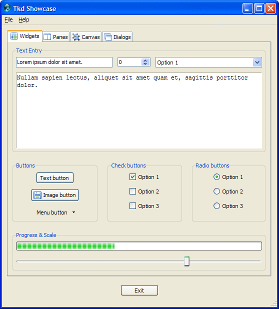

#tkd
**GUI toolkit for the D programming language**

---

## Overview

Tkd is a fully cross-platform GUI toolkit based on
[Tcl/Tk](http://www.tcl.tk/). Tkd allows you to build GUI applications easily
and with the knowledge of a consistent, native look and feel on every platform.

### Why Tcl/Tk?

Tkd development was initiated based on the performance and uptake of the
[Tkinter](https://wiki.python.org/moin/TkInter) toolkit distributed as a
standard part of the [Python](https://www.python.org/) programming language.
Tkinter allows developers easy access to GUI programming with very little
learning. Being the _de facto_ GUI toolkit of Python has introduced more
developers to GUI application programming and increased the popularity of the
language as a whole. Tkd is an attempt to provide D with the same resource.

### Supported platforms

* Windows
* Linux
* Mac OSX

## Example

There is an example in this package which can be built using dub. Clone
this repository and use the following command to build this example to see
what's possible.
```
dub --config=example
```


### Usage

Just import the `tkd.tkdapplication` module and all tkd elements are publically
imported.

```d
import tkd.tkdapplication;                               // Import Tkd.

class Application : TkdApplication                       // Extend TkdApplication.
{
	private void exitCommand(CommandArgs args)           // Create a callback.
	{
		this.exit();                                     // Exit the application.
	}

	override protected void initInterface()              // Initialise user interface.
	{
		auto frame = new Frame(2, ReliefStyle.groove)    // Create a frame.
			.pack(10);                                   // Place the frame.

		auto label = new Label(frame, "Hello World!")    // Create a label.
			.pack(10);                                   // Place the label.

		auto exitButton = new Button(frame, "Exit")      // Create a button.
			.setCommand(&this.exitCommand)               // Use the callback.
			.pack(10);                                   // Place the button.
	}
}

void main(string[] args)
{
	auto app = new Application();                        // Create the application.
	app.run();                                           // Run the application.
}
```

## Documentation

There is full HTML documentation within the repository inside the
[docs](https://github.com/nomad-software/tkd/tree/master/docs/) directory.

### GUI elements

#### Windows

These windows are containers for widgets to provide a user interface to the
program. Every application has at least one top level window.

| Window | Description |
| :----- | :---------- |
| [Window](http://htmlpreview.github.io/?https://github.com/nomad-software/tkd/master/docs/tkd/window/window.html) | A window is similar to a frame except that it is created as a top level window. The primary purpose of a window is to serve as a dialog box and/or collections of widgets. |

#### Menus

Menus allow a user to select options from a predefined list. Menus can be
attached to a window (via a menu bar) or popped up independantly.

| Menu | Description |
| :----- | :---------- |
| [MenuBar](http://htmlpreview.github.io/?https://github.com/nomad-software/tkd/master/docs/tkd/widget/menu/menubar.html) | A menubar is the bar across the top of a window holding the menu items. |
| [Menu](http://htmlpreview.github.io/?https://github.com/nomad-software/tkd/master/docs/tkd/widget/menu/menu.html) | The cascading menu that items are selected from. These menus can be nested as items in another.|

#### Widgets

These are the building blocks of all Tkd applications and allow the user to
directly interact with your program. These are placed on windows via geometry
methods.

| Widget | Description |
| :----- | :---------- |
| [Button](http://htmlpreview.github.io/?https://github.com/nomad-software/tkd/master/docs/tkd/widget/button.html) | A button widget displays a textual label and/or image, and evaluates a command when pressed. |
| [Canvas](http://htmlpreview.github.io/?https://github.com/nomad-software/tkd/master/docs/tkd/widget/canvas.html) | Canvas widgets implement structured graphics. A canvas displays any number of items, which may be things like rectangles, circles, lines, and text. Items may be manipulated (e.g. moved or re-colored) and commands may be associated with items in much the same way that the bind command allows commands to be bound to widgets. |
| [CheckButton](http://htmlpreview.github.io/?https://github.com/nomad-software/tkd/master/docs/tkd/widget/checkbutton.html) | A checkbutton widget is used to show or change a setting. It has two states, selected and deselected. The state of the checkbutton may be linked to a value. |
| [ComboBox](http://htmlpreview.github.io/?https://github.com/nomad-software/tkd/master/docs/tkd/widget/combobox.html) | A combobox combines a text field with a pop-down list of values; the user may select the value of the text field from among the values in the list. |
| [Entry](http://htmlpreview.github.io/?https://github.com/nomad-software/tkd/master/docs/tkd/widget/entry.html) | An entry widget displays a one-line text string and allows that string to be edited by the user. |
| [Frame](http://htmlpreview.github.io/?https://github.com/nomad-software/tkd/master/docs/tkd/widget/frame.html) | A frame widget is a container, used to group other widgets together. |
| [LabelFrame](http://htmlpreview.github.io/?https://github.com/nomad-software/tkd/master/docs/tkd/widget/labelframe.html) | A label frame widget is a container used to group other widgets together. It has an optional label, which may be a plain text string or another widget. |
| [Label](http://htmlpreview.github.io/?https://github.com/nomad-software/tkd/master/docs/tkd/widget/label.html) | A label widget displays a textual label and/or image. |
| [MenuButton](http://htmlpreview.github.io/?https://github.com/nomad-software/tkd/master/docs/tkd/widget/menubutton.html) | A menu button widget displays a textual label and/or image, and displays a menu when pressed. |
| [NoteBook](http://htmlpreview.github.io/?https://github.com/nomad-software/tkd/master/docs/tkd/widget/notebook.html) | A notebook widget manages a collection of panes and displays a single one at a time. Each pane is associated with a tab, which the user may select to change the currently-displayed pane. |
| [PanedWindow](http://htmlpreview.github.io/?https://github.com/nomad-software/tkd/master/docs/tkd/widget/panedwindow.html) | A paned window widget displays a number of subwindows, stacked either vertically or horizontally. The user may adjust the relative sizes of the subwindows by dragging the sash between panes. |
| [ProgressBar](http://htmlpreview.github.io/?https://github.com/nomad-software/tkd/master/docs/tkd/widget/progressbar.html) | A progress bar widget shows the status of a long-running operation. |
| [RadioButton](http://htmlpreview.github.io/?https://github.com/nomad-software/tkd/master/docs/tkd/widget/radiobutton.html) | Radio button widgets are used in groups to show or change a set of mutually-exclusive options. |
| [Scale](http://htmlpreview.github.io/?https://github.com/nomad-software/tkd/master/docs/tkd/widget/scale.html) | A scale widget is typically used to control the numeric value that varies uniformly over some range. A scale displays a slider that can be moved along over a trough, with the relative position of the slider over the trough indicating the value. |
| [ScrollBar](http://htmlpreview.github.io/?https://github.com/nomad-software/tkd/master/docs/tkd/widget/scrollbar.html) | Scrollbar widgets are typically linked to an associated window that displays a document of some sort, such as a file being edited or a drawing. A scrollbar displays a thumb in the middle portion of the scrollbar, whose position and size provides information about the portion of the document visible in the associated window. The thumb may be dragged by the user to control the visible region. Depending on the theme, two or more arrow buttons may also be present; these are used to scroll the visible region in discrete units. |
| [Separator](http://htmlpreview.github.io/?https://github.com/nomad-software/tkd/master/docs/tkd/widget/separator.html) | A separator widget displays a horizontal or vertical separator bar. |
| [SizeGrip](http://htmlpreview.github.io/?https://github.com/nomad-software/tkd/master/docs/tkd/widget/sizegrip.html) | A sizegrip widget (also known as a grow box) allows the user to resize the containing toplevel window by pressing and dragging the grip. |
| [SpinBox](http://htmlpreview.github.io/?https://github.com/nomad-software/tkd/master/docs/tkd/widget/spinbox.html) | A spinbox widget is an entry widget with built-in up and down buttons that are used to either modify a numeric value or to select among a set of values. |
| [Text](http://htmlpreview.github.io/?https://github.com/nomad-software/tkd/master/docs/tkd/widget/text.html) | A text widget displays one or more lines of text and allows that text to be edited. Text widgets support embedded widgets or embedded images. |
| [TreeView](http://htmlpreview.github.io/?https://github.com/nomad-software/tkd/master/docs/tkd/widget/treeview.html) | The treeview widget displays a hierarchical collection of items. Each item has a textual label, an optional image, and an optional list of data values. |

#### Geometry methods

These methods are used to place widgets onto a window.

| Method | Description |
| :----- | :---------- |
| [Grid](http://htmlpreview.github.io/?https://github.com/nomad-software/tkd/master/docs/tkd/widget/widget.html#Widget.grid) | Geometry method for placing this widget inside its parent using an imaginary grid. Somewhat more direct and intuitive than pack. Choose grid for tabular layouts, and when there's no good reason to choose something else. |
| [Pack](http://htmlpreview.github.io/?https://github.com/nomad-software/tkd/master/docs/tkd/widget/widget.html#Widget.pack) | Geometry method for loosely placing this widget inside its parent using a web browser model. Widgets flow around each other in the available space. |
| [Place](http://htmlpreview.github.io/?https://github.com/nomad-software/tkd/master/docs/tkd/widget/widget.html#Widget.place) | Geometry method for placing this widget inside its parent using absolute positioning. |

#### Dialog boxes

These are pre-built dialog boxes to gather various pieces of data from a user.

| Dialog box | Description |
| :----- | :---------- |
| [ColorDialog](http://htmlpreview.github.io/?https://github.com/nomad-software/tkd/master/docs/tkd/window/dialog/colordialog.html) | Pops up a dialog box for the user to select a color. |
| [DirectoryDialog](http://htmlpreview.github.io/?https://github.com/nomad-software/tkd/master/docs/tkd/window/dialog/directorydialog.html) | Pops up a dialog box for the user to select a directory. |
| [FontDialog](http://htmlpreview.github.io/?https://github.com/nomad-software/tkd/master/docs/tkd/window/dialog/fontdialog.html) | Pops up a dialog box for the user to select a font. |
| [MessageDialog](http://htmlpreview.github.io/?https://github.com/nomad-software/tkd/master/docs/tkd/window/dialog/messagedialog.html) | Pops up a dialog box with a user defined message and buttons. |
| [OpenFileDialog](http://htmlpreview.github.io/?https://github.com/nomad-software/tkd/master/docs/tkd/window/dialog/openfiledialog.html) | Pops up a dialog box for the user to open a file. |
| [SaveFileDialog](http://htmlpreview.github.io/?https://github.com/nomad-software/tkd/master/docs/tkd/window/dialog/savefiledialog.html) | Pops up a dialog box for the user to save a file. |

## Building

 * Tkd has been developed and tested using the latest DMD compiler.
 * It's recommended to use the [dub](http://code.dlang.org/about) build tool to
   build all Tkd projects.

## Dependencies

### Source code

Tkd requires other D source libraries to correctly use and link against
pre-existing C libraries. The source dependencies are as follows:

 * https://github.com/nomad-software/tcltk
 * https://github.com/nomad-software/x11

Dub handles these automatically and during a build acquires them. While
building, the tcltk repository is configured to link against the required
Tcl/Tk libraries, hence they need to be installed for the application to
function.

### Libraries

Tkd requires version **8.6** (or greater) of the Tcl/Tk libraries installed. A
small exception is when creating a self-contained installation on Windows. See
details below. Tcl/Tk itself requires the x11 libraries installed on Linux only.

#### Windows

You can copy the DLL's and the initialization script library directory into the
root of the finished application. These files can be conveniently found in the
`dist` folder within the [tcktk](https://github.com/nomad-software/tcltk)
repository. Your finished application's directory would then look something
like this:
```
project
├── app.exe
├── tcl86t.dll
├── tk86t.dll
└── library
    └── *.tcl files
```
You can automate this process when building an application by placing the
following in the application's `dub.json` build file. Dub version **0.9.22** or
greater is required. The following assumes `build` is the output directory.
```
...
"postGenerateCommands-windows-x86": [
	"copy $TCLTK_PACKAGE_DIR\\dist\\x86\\tcl86t.dll build\\tcl86t.dll /y",
	"copy $TCLTK_PACKAGE_DIR\\dist\\x86\\tk86t.dll build\\tk86t.dll /y",
	"xcopy $TCLTK_PACKAGE_DIR\\dist\\library build\\library /i /e /y",
],
"postGenerateCommands-windows-x86_64": [
	"copy $TCLTK_PACKAGE_DIR\\dist\\x86_64\\tcl86t.dll build\\tcl86t.dll /y",
	"copy $TCLTK_PACKAGE_DIR\\dist\\x86_64\\tk86t.dll build\\tk86t.dll /y",
	"xcopy $TCLTK_PACKAGE_DIR\\dist\\library build\\library /i /e /y",
],
...
```

#### Linux/Mac OSX

On Linux and Mac OSX things are a little easier as both operating systems have
Tcl/Tk installed by default. If however they do not have the latest version,
the libraries can be updated via their respective package managers. The linked
libraries are **libtcl** and **libtk**.

## Notes

### Linux Mint users

On Linux Mint (may be the same on other Ubuntu derivatives), installing libtcl8.6-dev and libtk8.6-dev may not be enough. Why ? Because the libraries are installed inside the folder `/usr/lib/x86_64-linux-gnu` and not just `/usr/lib`.

So you can run these commands, before calling dub on your project

```bash
sudo ln -s /usr/lib/x86_64-linux-gnu/libtcl8.6.a /usr/lib/libtcl.a
sudo ln -s /usr/lib/x86_64-linux-gnu/libtk8.6.a /usr/lib/libtk.a
sudo ln -s /usr/lib/x86_64-linux-gnu/libtcl8.6.so /usr/lib/libtcl.so
sudo ln -s /usr/lib/x86_64-linux-gnu/libtk8.6.so /usr/lib/libtk.so
```

### Debugging

The following debug flags can be passed to Tkd to help debug certain issues.

```
-debug=log
```
Write a log called `debug.log` in the current directory detailing all Tcl/Tk
interaction logging all commands the Tcl interpreter is executing. (All errors
are marked as WARN.)

```
-debug=showTclErrors
```
Write all Tcl/Tk errors to stdout. This is useful to immediately be notified of
interpreter errors without trawling through the debug log.

### Widgets

#### Canvas

The postscript methods of this widget havn't been implemented yet due to time.
This means no exporting to postscript files or printing is available from this
widget. This can be added in the future if there is need.

#### Text

The extended text editing functionality of this widget has not been implement
because there are better, more modern editor widgets available separately. This
control is not indended to be used as a fully featured text editor.
